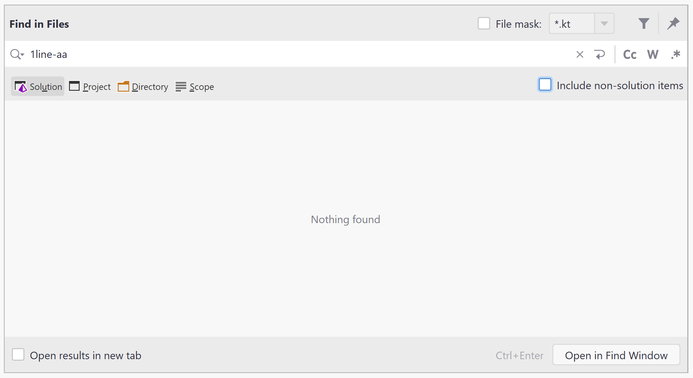
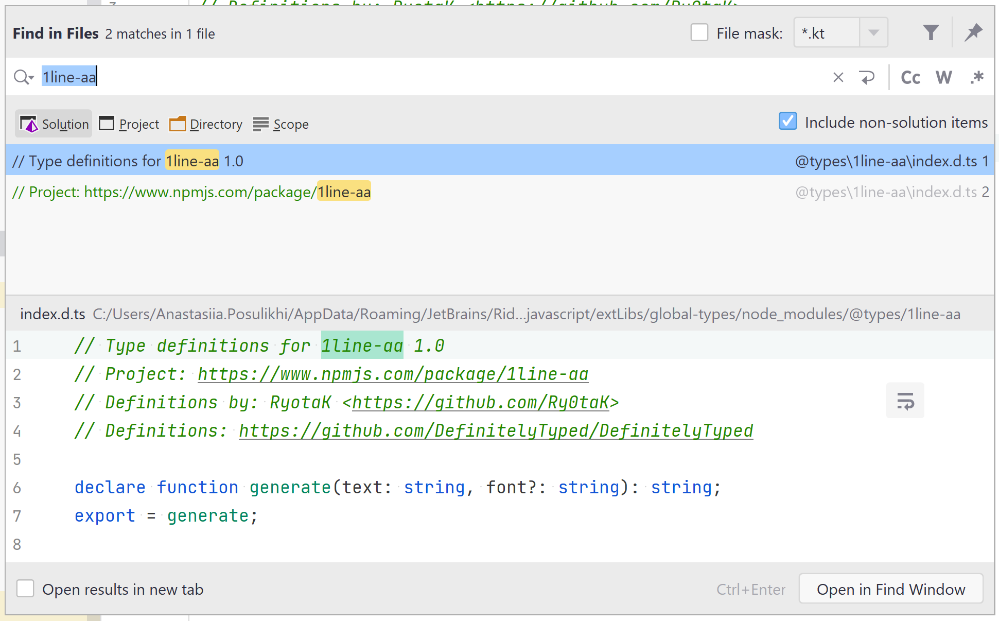

# Project model smoke
## Explorer (Solution/File System/Assembly/Unity Views)
### Main actions
_Precondition:_ open MainActionsSmoke project
#### Rename
1. Rename projects
2. Rename `Rename` and `ClientApp | src | Rename` folders and files inside

-  Rename via Refactor This... action
-  Rename via Right-click | Edit | Rename
-  Rename via a shortcut

#### Copy + paste
1. Use `Copy` folder to
- Copy to the same location
- Copy to another folder of the same project
- Copy to a `ClientApp | src` folder
- Copy to another project
- Copy to another solution, opened separately

#### Move
1. Move `Copy` folder
2. Move separate files from this folder

- Move inside a project between different folders
- Move to a `ClientApp | src` folder
- Move to another project
- Move to another solution, opened separately
#### Delete
1. Delete `Rename` folder and undo
2. Delete `ClientApp | src | Rename` and undo
#### Add
1. Use add action on the project level to add:
- file
- directory
- scratch
- existing item
- reference
2. Use add action on the solution level to add:
- new project
- existing project

#### Include/exclude files + nested files, folders + subfolders
1. Include/exclude `Rename` folder
2. Include/exclude different files in this folder

Also, check the case [RIDER-63566](https://youtrack.jetbrains.com/issue/RIDER-63566) in XAML solution folder projects

**_Note:_** repeat with F# and VB (optional) projects
### Attached folders
1. Attach/detach a folder/solution folder
2. Attach/detach an ASP.NET Core app (node_modules npm packages, listed in package.json, should be indexed, others shouldn't)
4. https://youtrack.jetbrains.com/issue/RIDER-61055
5. https://youtrack.jetbrains.com/issue/RIDER-60581
6. https://youtrack.jetbrains.com/issue/RIDER-61116
### Stop index feature
_Precondition:_ open StopIndexSmoke project
- **Excluded folder** - folder is out of solution and isn't indexed
- **ExcludedFromSolutionButInIndex** - folder is out of solution, but is indexed
- **FolderInIndex** - folder is in solution and is indexed
- **FolderOutOfIndex** - folder is in solution, but isn't indexed

**Files that are not indexed couldn't be searched via Search Everywhere & Find in Files unless `Include non-solution items` option is checked**

Use `Stop Index` feature to
- Stop indexing a file
- Stop indexing a folder
- Stop indexing a project

### File/Folder Properties
- for a single file/folder
- for multiple files/folders

### Project Properties
< work in progress >

[RIDER-60325](https://youtrack.jetbrains.com/issue/RIDER-60325)

### Locate/Select in Solution View
Use the `Locate/Select in Solution View` action to locate files of different type
- cs
- fs
- cshtml/razor
- js/ts
- console (refer to [RIDER-61590](https://youtrack.jetbrains.com/issue/RIDER-61590))

Repeat with `Select in` action
### Copy Path
_Precondition:_ open any file in the editor

1. Right-click the tab and open Copy Path popup
2. Copy:
- Absolute Path
- File Name
- Path From Content Root 
- Path From Repository Root
- GitHub Repository URL
- Toolbox URL
---
1. Right-click the file/folder/project/solution folder/solution node in Explorer
2. Copy:
- Absolute Path
- File Name
- Path From Content Root
- Path From Repository Root
- GitHub Repository URL
- Toolbox URL
---
1. Open Copy Path popup via Edit menu
2. Copy:
- Absolute Path
- File Name
- Path With Line Numbers
- Path From Content Root
- Path From Repository Root
- GitHub Repository URL
- Toolbox URL
### Saving state between Rider restart
1. Expand several solution folder nodes
2. Expand several project nodes
3. Expand several folder nodes
4. Restart Rider
5. Compare the state before and after restart

Refer to [RIDER-5094](https://youtrack.jetbrains.com/issue/RIDER-5094)
## Scopes
There are 3 custom scopes predefined:
- Scope From 211 - 
- Blazor Project Scope - 
- Attached Folder Scope - in progress

Check:
- file colors in Explorer
- adding a new custom scope
- search in scope using Search Everywhere, Find/Replace in Files
## Navigation
### Search Everywhere (Go to All, Go to File)
- https://youtrack.jetbrains.com/issue/RIDER-59079
- https://youtrack.jetbrains.com/issue/RIDER-61397
- https://youtrack.jetbrains.com/issue/RIDER-63634
### Speed Search in Explorer
Search for:
- Several words and spaces between them
- Several words without spaces between them
- Numbers
- CumelHumps
- Upper case letters
- Down case letters
- Minimum occurrence (1 symbol)
- General occurence (~50 symbols)
- Huge occurrence (255+ symbols)
### Find/Replace in Files
- https://youtrack.jetbrains.com/issue/RIDER-43469
- https://youtrack.jetbrains.com/issue/RIDER-59474
- https://youtrack.jetbrains.com/issue/RIDER-20764
- https://youtrack.jetbrains.com/issue/RIDER-59693
- https://youtrack.jetbrains.com/issue/RIDER-63634
- https://youtrack.jetbrains.com/issue/RIDER-64739
### Nav bar
####View | Appearance | Navigation Bar is enabled
No full paths for
- decompiled sources
- scratches
- consoles
- source cache (refer to [RIDER-65773](https://youtrack.jetbrains.com/issue/RIDER-65773))

Also, check these cases:
- https://youtrack.jetbrains.com/issue/RIDER-59087
- https://youtrack.jetbrains.com/issue/RIDER-64425
- https://youtrack.jetbrains.com/issue/RIDER-59030
####View | Appearance | Navigation Bar is disabled
Use `Jump to Navigation Bar` action to navigate to
- solution node
- different projects
- folders
- files (cs, fs, cshtml/razor, js/ts, console, different nested files)
- node_modules
## Web
_Precondition:_ open AngularWebProject project
https://youtrack.jetbrains.com/issue/RIDER-61439
### node_modules
1. Indexing should be performed only for those npm packages that are listed in the package.json file
2. Search in SE ...
3. Search in Find in Files
4. https://youtrack.jetbrains.com/issue/RIDER-58303
5. https://youtrack.jetbrains.com/issue/RIDER-59127
### Angular CLI
#### Installation
`npm install -g @angular/cli`
#### Project creation
1. Switch to `ClientApp` directory in Terminal
2. `ng new TestProject`
#### Build and serve locally
`ng serve TestProject`
#### Creating files/folders
`ng generate` https://angular.io/cli/generate#ng-generate

**Example** of adding a `test` folder to the `ClientApp | src | app` module:
`ng generate c test --module app` (refer to [RIDER-61533](https://youtrack.jetbrains.com/issue/RIDER-61533))
### Material Design lib
< work in progress >
### Custom JS libraries
#### Installation
1. Open `File | Settings | Languages & Frameworks | JavaScript | Libraries`
2. Add a `@types/1line-aa` (or any other)  custom library to this solution
3. Restart Rider

**Expected:** the custom library is in the list

Refer to [RIDER-62506](https://youtrack.jetbrains.com/issue/RIDER-62506)
#### Libs indexing 
4. Search for `1line-aa` in Find in Files 

**Expected:**

Refer to [RIDER-63026](https://youtrack.jetbrains.com/issue/RIDER-63026)